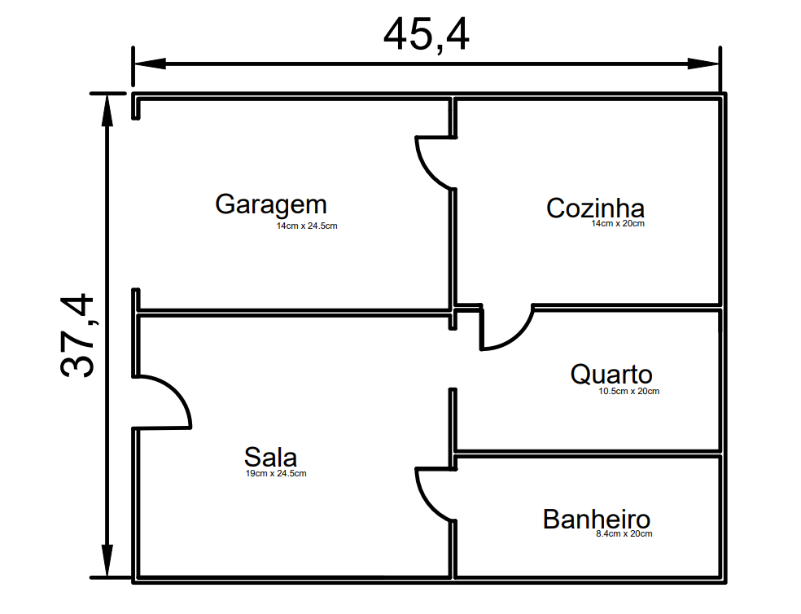

# Sistema para automação de componentes eletricos de uma casa.

- 

## Colaboradores:
  
  - [@jjunio01](https://github.com/jjunio01) José Junio Araújo da Silva  
  - [@mikaelbr073](https://github.com/Mikaelbr073) Mikael Carvalho de Barros
